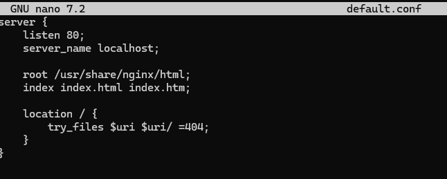
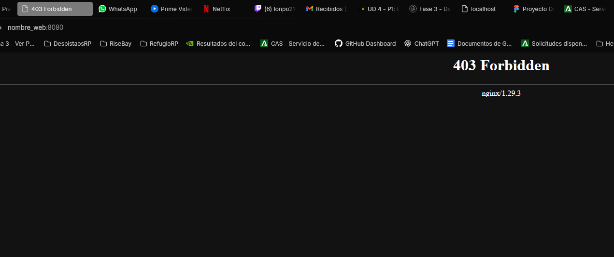
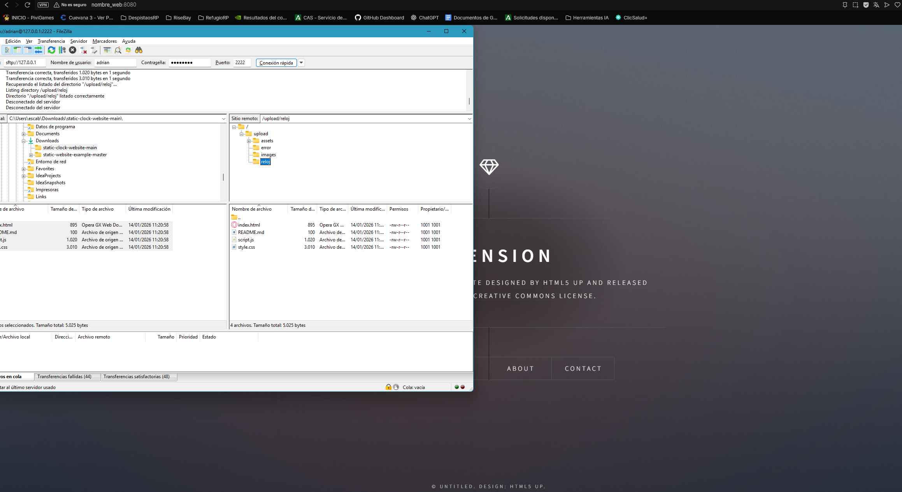
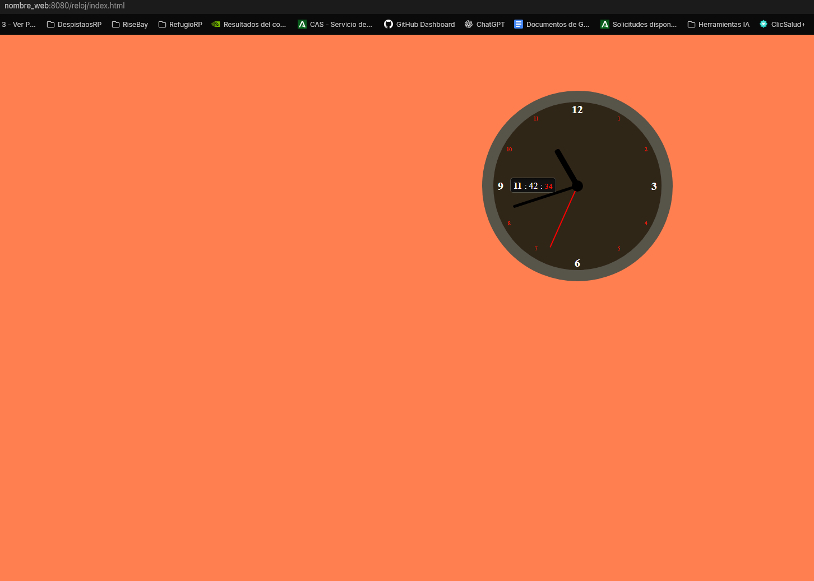
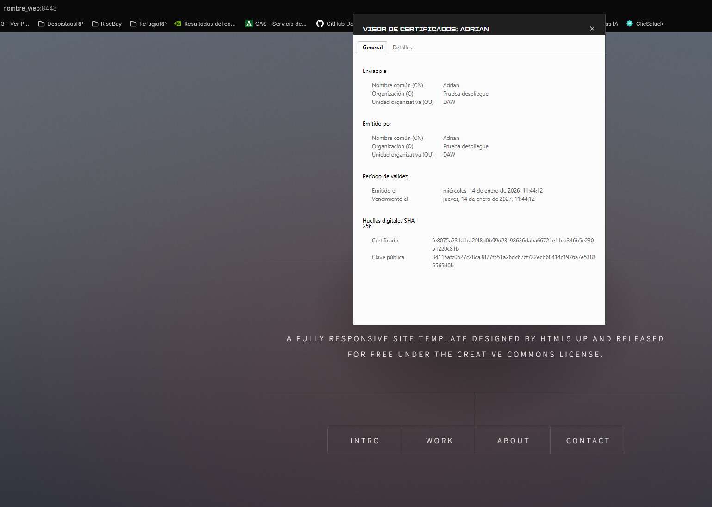

## Fase 1: Instalación y Configuración

### Servicio Nginx activo

### Configuración cargada

### Resolución de nombres

### Contenido Web

## Fase 2: Transferencia SFTP (Filezilla)

### Conexión SFTP exitosa

### Permisos de escritura

## Fase 3: Infraestructura Docker

### Contenedores activos

### Persistencia (Volumen Compartido)

### Despliegue Multi-sitio

## Fase 4: Seguridad HTTPS

### Cifrado SSL

### Redirección Forzada

